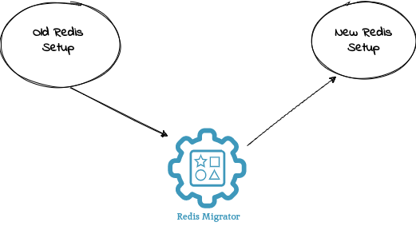

<p align="left">
  
</p>

[](https://github.com/opstree/redis-migration)
[](http://golang.org)

[](https://goreportcard.com/report/github.com/opstree/redis-migration)
[](LICENSE)


Redis migrator is a golang based tool to migrate the database keys from one redis cluster to another. This tool can be used to migrate different types of redis keys from one redis setup to another.

Redis supported keys:-

- String keys
- Hash keys



## Quickstart

A quickstart guide for installing, using and managing redis-migrator.

### Installation

redis-migrator installation packages can be found inside [Releases](https://github.com/opstree/redis-migration/releases)

Supported Platforms:-

- Binaries are supported for Linux and Windows platform with these architectures:-
  - Amd 64
  - Arm 64
  - Amd 32
  - Arm 32

For installation on debian and redhat based system, `.deb` and `.rpm` packages can be used.

For installing on MacOS system, use brew:-

```shell
brew install redis-migrator
```

### Configuration

For using redis-migrator, we have to create a configuration file and provide some needful information to it. An example configuration file will look like this:-

```yaml
---
old_redis:
  host: 172.17.0.3 # IP redis server
  port: "6379" # Port redis server
  password: "" # Password of redis server, leave empty if there is no password

migration_databases: [0] # Databases list which needs to be migrated

concurrent_workers: 4

new_redis:
  host: 172.17.0.4
  port: "6379"
  password: ""
```

### Available Options

There are help page available for redis-migrator which can be called by help or --help command.

```shell
A tool for migrating redis database and its keys.

Usage:
  redis-migrator [flags]
  redis-migrator [command]

Available Commands:
  help        Help about any command
  migrate     Runs redis-migrator to run migration
  version     Prints the current version.

Flags:
  -h, --help                help for redis-migrator
      --log.format string   redis-migrator log format. (default "text")
      --log.level string    redis-migrator logging level. (default "info")

Use "redis-migrator [command] --help" for more information about a command.
```
